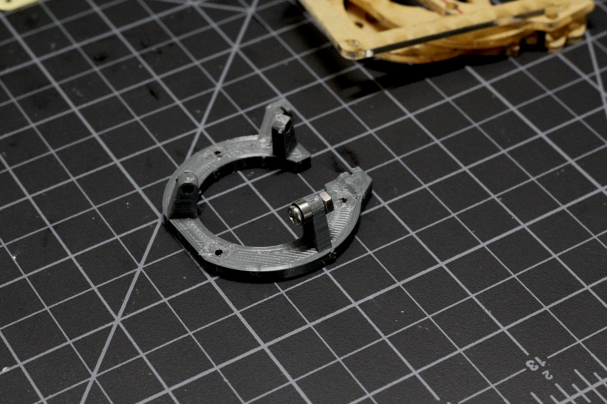
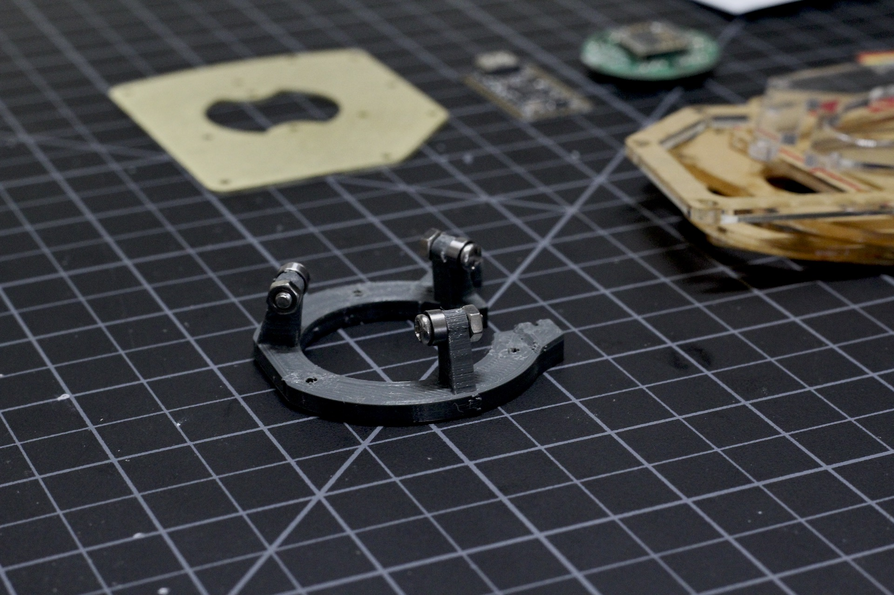
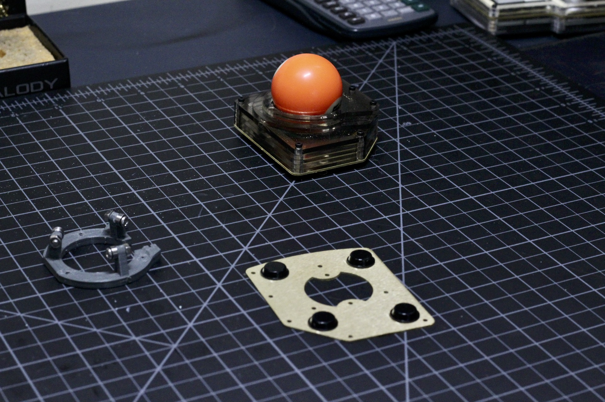
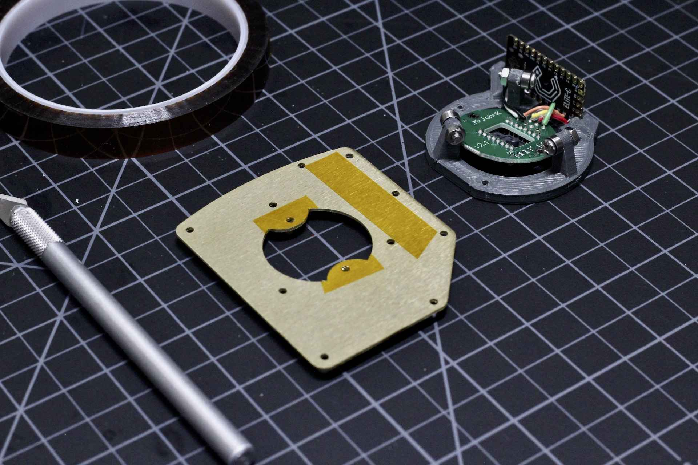
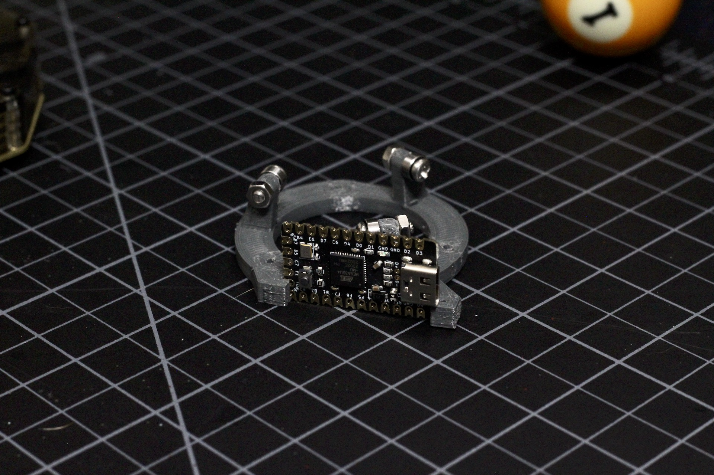
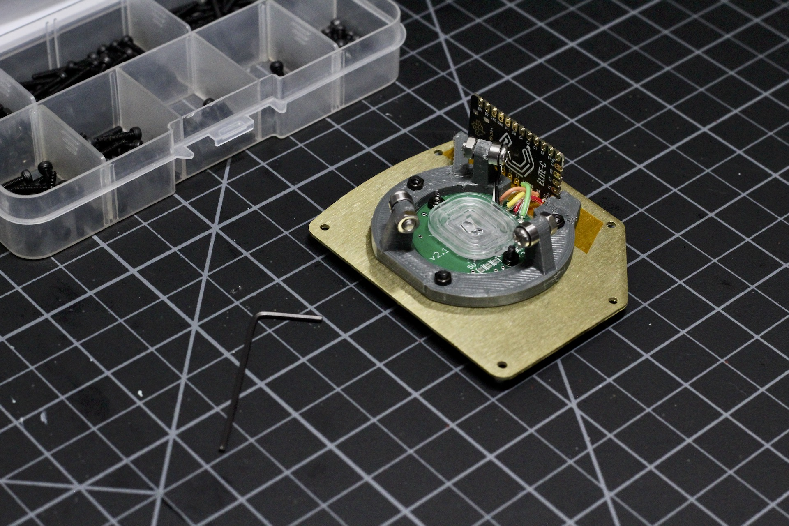
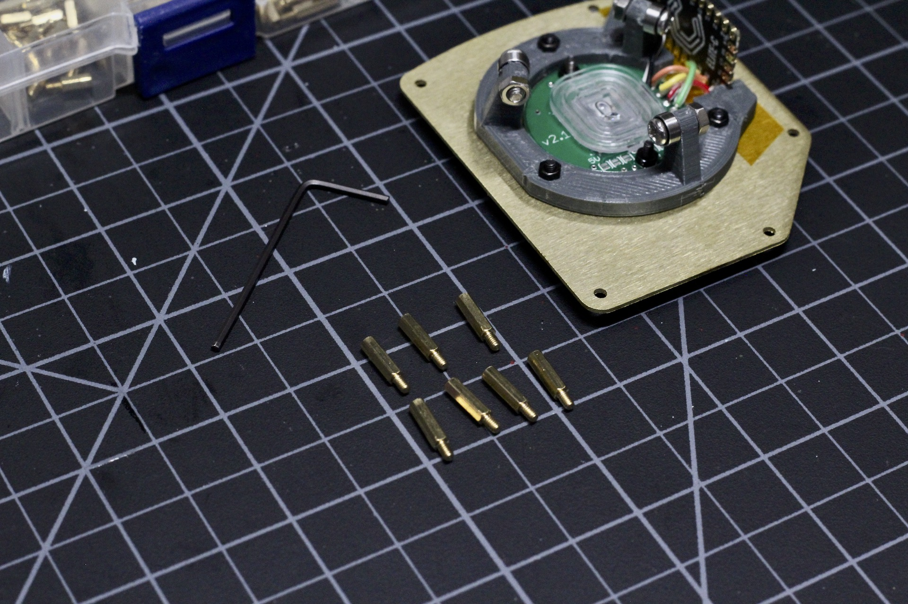
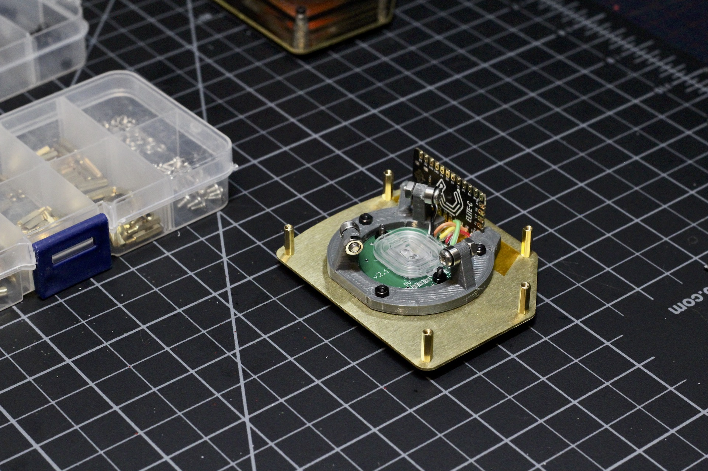

# Build Guide - Structural Assembly

* [Getting Started](../docs/bg_getting_started.md)
* [Electronics](../docs/bg_electronics.md)
* Structural Assembly
* [Acrylic Case](../docs/bg_case_acrylic.md)
* [Printed Case](../docs/bg_case_printed.md)
* [Parts list (BOM)](../docs/bom.md)

To keep oriented during througout this guide, here is a photo of everything put together without the case.

### Print Frame

You'll need to print the vertical_frame.stl file.  It lays flat on the bed and will not require any supports.  It's
pretty small, so you might as well go 100% infill.  Depending on your print quality, you might need to drill out the
holes to fit the screws through.  

### Mount Bearings

Use the M3 round head bolts and nuts to secure the bearings to the frame.  The mount for each bearing is offset so that 
the roller bearings contact the ball properly.  Each bearing needs to be mounted on the clockwise side of the support.
Check the photos if you have any questions.  You can secure these finger tight.

Once they are in place, set the ball on top and everything should roll pretty smoothly.  

You can adjust the tightness of the nuts if they are binding.  The bearings will take some time to break in,
so don't be too concerned if they are a bit scratchy, just check that they roll freely.

### Prepare the base

For the base, you can either 3d print the file bottom.stl in the case/printed folder or get the bottom laser 
cut from metal using the bottom.dxf in either of the case/laser_cut folders.  Since the sensor sticks out of
bottom of the case slightly to reduce to overall height, you'll need to put feet on it before continuing assmbly.

If you are using a metal base, it's a good idea to put down a layer of insulation using either Kapton or electrical tape.  Here's
a photo showing the areas where contact might happen and that should be insulated.  

### Fit the MCU to the frame

The MCU should friction fit in the slots as show in the photo above and the detail below.  Depending on your printer, you might
need to file these slightly.  You can see above how I routed the wires, but it depens on how long you ended up making them.  

### Secure the Frame / Sensor

Both the frame and the sensor mount on bolts inserted from the bottom.  The length is not overly critical here, just make sure
they are not soooo long that they rub on the ball.  Use the nuts to secure everything together.  The photo below shows the 
three bolts that hold the frame and the two bolts that hold the sensor.

### Prep for the case

No matter which case you use, it's supported/aligned with seven 10mm standoffs.  You can either use the
male/female ones pictured below or you can use the double female ones either work.  You'll want to secure
these to the bottom plate in the provided holes.

Here is a view of the underside with the standoffs secured with nuts.

Now the structure is done and the case is ready to be installed. 

There are two case options available:
* [Acrylic Case](../docs/bg_case_acrylic.md)
* [Printed Case](../docs/bg_case_printed.md)
